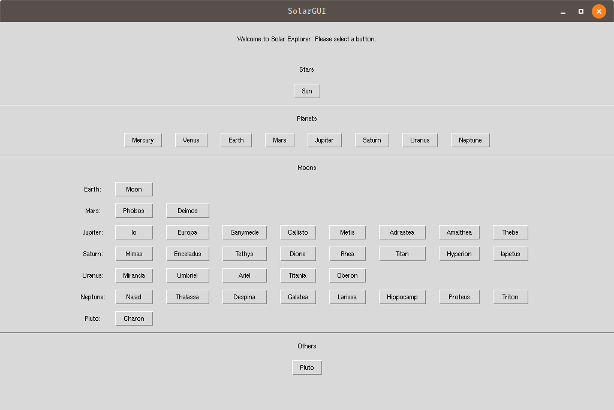
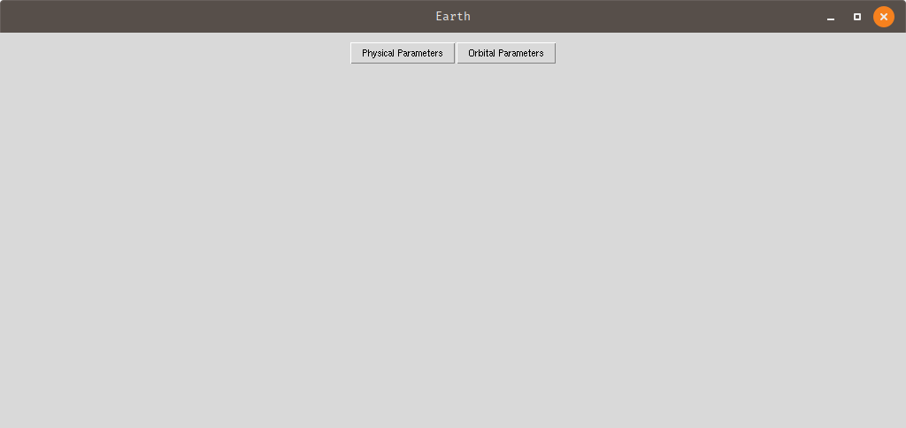
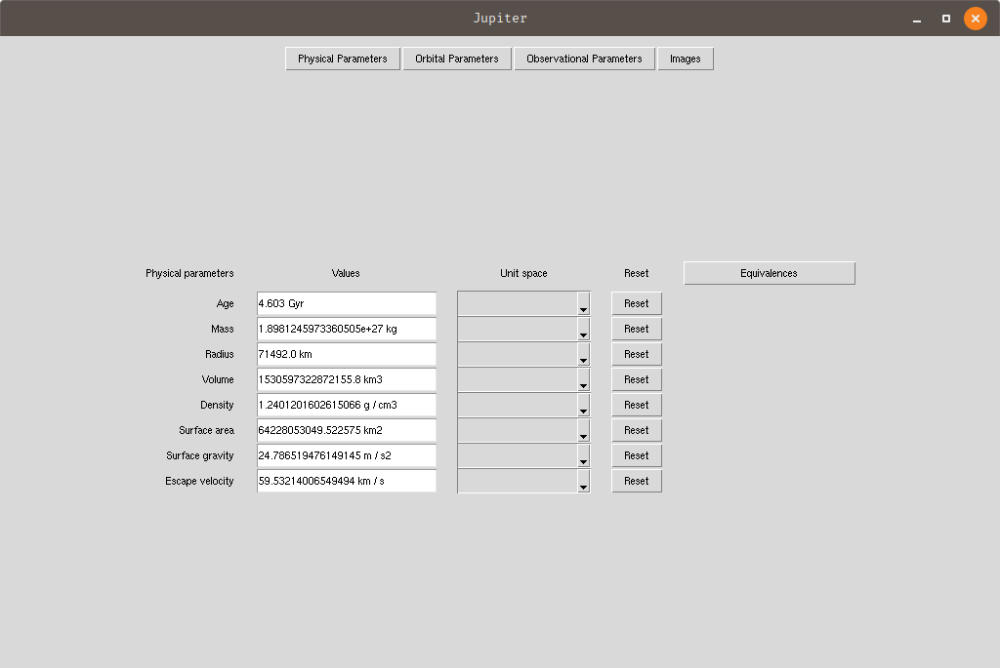
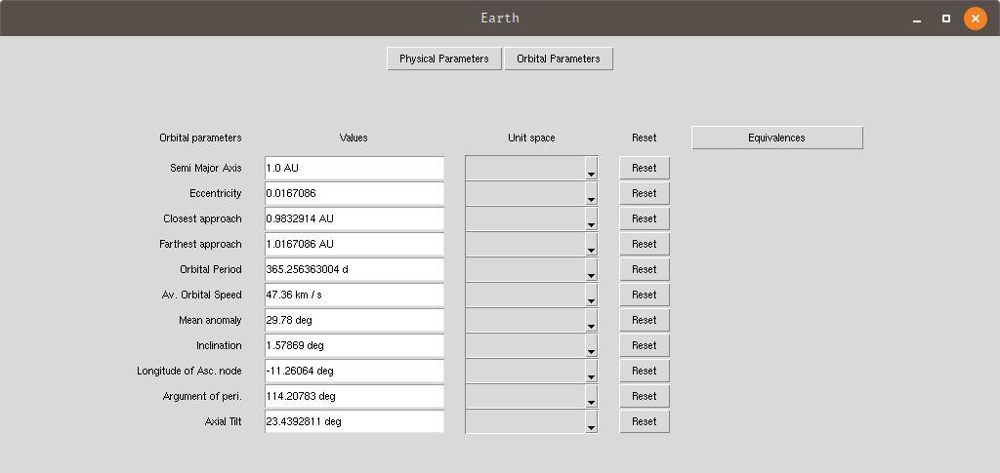
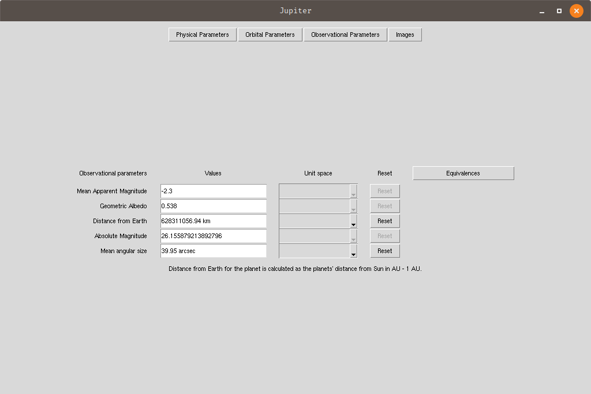
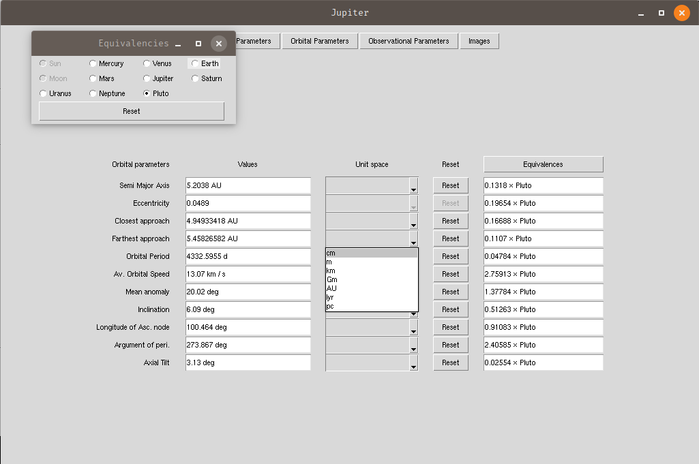
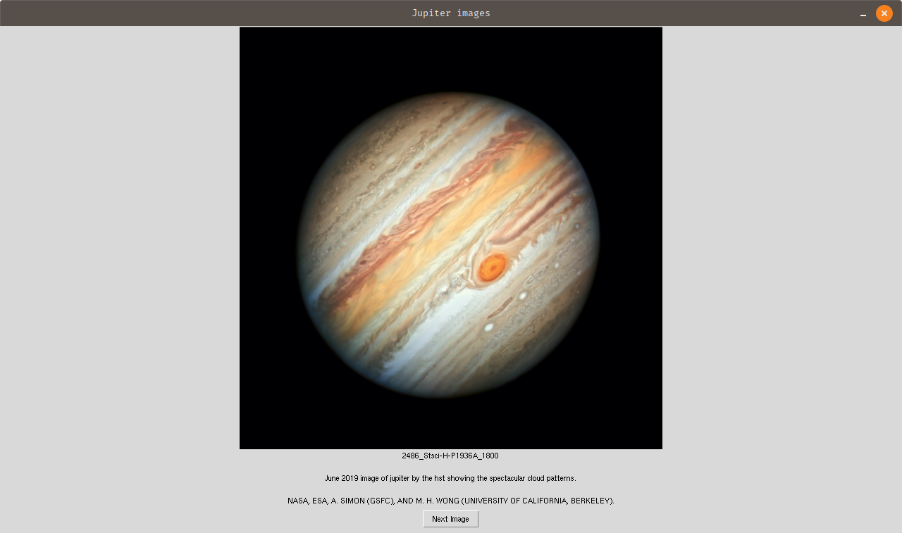

# SolarGUI

A program which contains information about the solar system planets, moon, pluto, Sun, and more.

## What it is?

The SolarGUI is a fun little project aimed to gather planetary (and other) information. See the values of various
physical parameters in standard (SI, CGS) units and celestial equivalencies.

### Support

Currently, the SolarGUI application is tested with **Python** `v3.7`, `3.8` and `3.9`.

## How to install?

### pip

The SolarGUI is available via `pip`. Simply use the command,

`pip install SolarGUI`

### wheel file

The wheel can also be downloaded from
this [wheel](https://github.com/AstrophysicsAndPython/SolarGUI/releases/download/v0.1.4/SolarGUI-0.1.4-py3-none-any.whl)
link and installed via

`pip install [download_directory]/SolarGUI-0.1.6-py3-none-any.whl`

Once the SolarGUI has been installed, you can simply launch it from the terminal/installation environment via,

`SolarGUI`

### Note:

_**The user should be made aware of the fact that not all the physical, orbital, or observational parameters are
known/available for the Moons of planets hence there will be `None` values when dealing with Moons of the planets.**_

The frontend of SolarGUI provides several buttons for stars, planets, moons, and other celestial objects.

Each button will open a new window with access to physical, orbital, observational (and optionally, images) buttons
which contain information regarding the particular objects' parameters,

Clicking on the desired button will trigger a frame for the particular properties of the celestial object.

For example, if the user selects `Physical Parameters`, the following parameters will be listed

1. age,
2. mass,
3. radius,
4. volume,
5. density,
6. surface area,
7. surface gravity, and
8. escape velocity.

Similarly, clicking on the `Orbital Parameters` will trigger the frame with orbital parameters in it, such as

1. Semi-major axis
2. Eccentricity
3. Perihelion distance
4. Apehelian distance
5. Orbital period
6. Average orbital speed
7. Mean anomaly
8. Inclination
9. Longitude of ascending node
10. Argument of perihelion, and
11. Axial tilt.

Same goes for the `Observational Parameters` with values,

1. Mean apparent magnitude[^1]
2. Geometric albedo[^2]
3. Distance from Earth[^3]
4. Absolute Magnitude[^4]
5. Mean angular size[^5]

[^1]: The mean apparent magnitude was either calculated as the mean of minimum and maximum apparent magnitude, or taken
as the value given.
[^2]: Where the value for geometric albedo wasn't provided, the value of albedo was used instead.
[^3]: The distance to Earth was found by subtracting the Planet-Moon distance from the Earth-Planet distance.
[^4]: The absolute magnitude is calculated based on the following formula
$M = m - 5\log10(d) + 5$
which may not be appropriate for the calculation of absolute magnitude for planets. This is planned to be fixed with the
next release.
[^5]: At times when only the angular size was provided, it was taken as the mean angular size of the object.

The dropdown menus will show various other units of measures. The equivalencies button on the top right can be used to
see the equivalent values for other celestial objects.

The images button contains a few selected images for the celestial objects (for now, only Sun and the planets including
Pluto)

