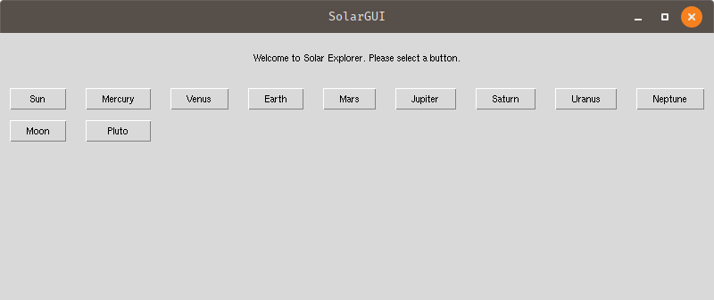
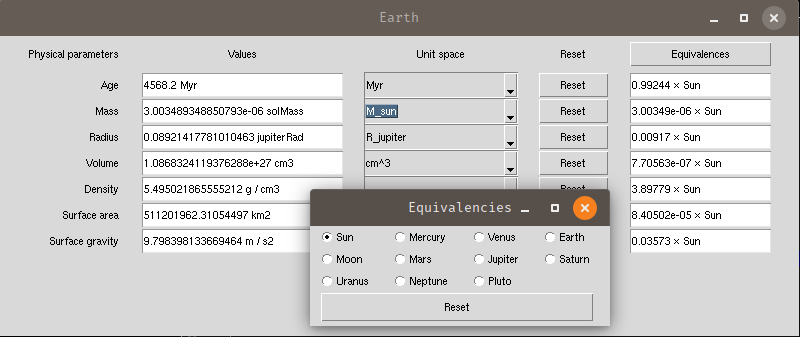

# SolarGUI

A program which contains information about the solar system planets, moon, pluto, Sun, and more.

## What it is?

The SolarGUI is a fun little project aimed to gather planetary (and other) information. See the values of various
physical parameters in standard (SI, CGS) units and celestial equivalencies.

### Support

Currently, the SolarGUI application is tested with **Python** `v3.7`, `3.8` and `3.9`.

## How to install?

The SolarGUI is available via `pip`. Simply use the command,

`pip install SolarGUI`

Once the SolarGUI has been installed, you can simply launch it from the terminal/installation environment via,

`SolarGUI`

The frontend of SolarGUI provides several buttons for different planets.

Each button will open a new window with information regarding the particular objects,

1. age,
2. mass,
3. radius,
4. volume,
5. density,
6. surface area, and
7. surface gravity.

The dropdown menus will show various other units of measures. The equivalencies button on the top right can be used to
see the equivalent values for other celestial objects.

## TODO

- [x] Add a comparison button/dropdown menu to check the values with respect to Earth/Jupiter/Sun.
- [ ] Segregate moons, dwarf planets, planets and other type of celestial objects.
- [x] Design adjustments of the GUI
- [ ] Separate button/menu for physical/orbital and other parameters.
- [ ] Some interesting plots (optional).
- [ ] Random facts button.
- [ ] Add citations
- [ ] Add a section of papers that study different properties of the celestial objects.
