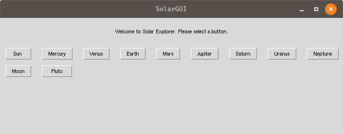

# SolarGUI
A program which contains information about the solar system planets, moon, pluto, Sun, and more.

## What it is?
The SolarGUI is a fun little project aimed to gather planetary (and other) information. See the values of various
physical parameters in standard (SI, CGS) and some fun units as well.

### Front-end

The frontend of SolarGUI provides several buttons for different planets.

Each button will open a new window with  information regarding the particular objects,
1. age,
2. mass,
3. radius,
4. volume,
5. density, 
6. surface area, and 
7. surface gravity.

The dropdown menus will show various other (standard and non-standard) units of measures.

## TODO
1. Fix README.md more
2. Add a fix to sudden planet window crashing the GUI.
3. Add a comparison button/dropdown menu to check the values with respect to Earth/Jupiter/Sun.
4. Segregate moons, dwarf planets, planets and other type of celestial objects.
5. Design adjustments of the GUI
6. Separate button/menu for physical/orbital and other parameters.
7. Some interesting plots (optional).
8. Random facts button.
